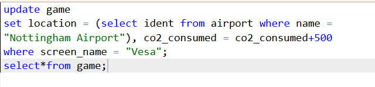
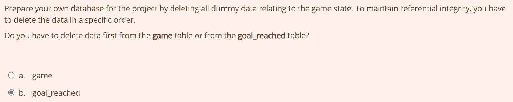
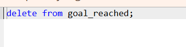
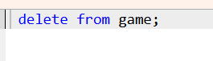

# Week 5
## Exercise 7 -Uptade Queries
### Question 1
update game 
set location = (select ident from airport where name = 
"Nottingham Airport"), co2_consumed = co2_consumed+500 
where screen_name = "Vesa"; 
select*from game;

### Question 2

### Question 3
delete from goal_reached;

### Question 4
 delete from game;
 